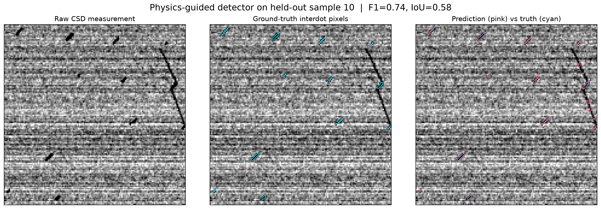
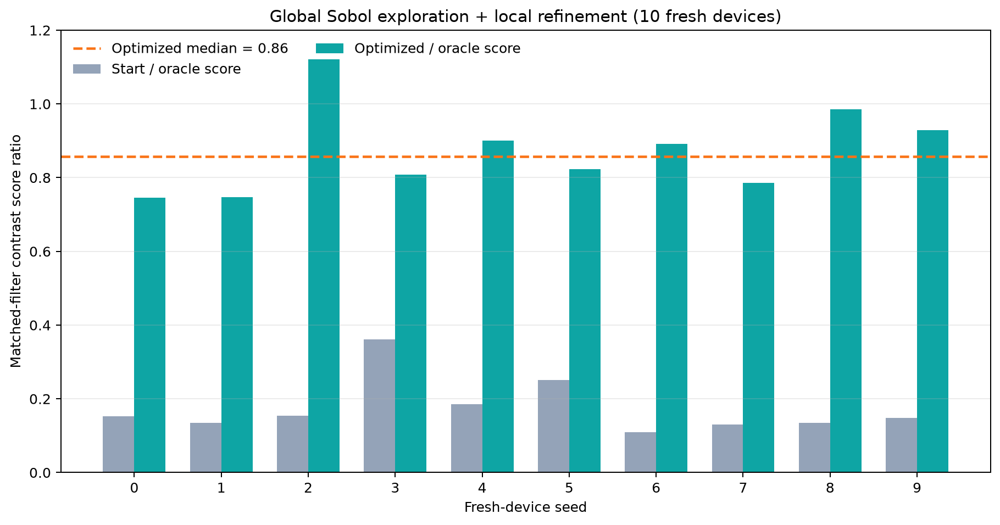

# C12 Hackathon — automated CSD detection and tuning

**10-minute presentation plan (English).** The editable deck is `slides.pptx`; slide images are in `assets/`.

---

## Slide 1 — Automate what an experimentalist can actually see (0:45)

**On slide**
- Challenge 1: find interdot pixels from a raw charge-stability diagram.
- Challenge 2: maximize interdot contrast on a fresh, hidden device.
- Principle: use measured images and physical calibration logic, not hidden state.

**Speaker notes**
A double-quantum-dot device is tuned through a charge-stability diagram in the two plunger gates. The simulator gives us a controlled sandbox, but the method should be defensible on a real instrument: every decision should come from an image we could actually measure. I will show a physics-guided detector and a drift-aware global optimizer.

---

## Slide 2 — What is an interdot in the image? (1:00)

**On slide**
- Interdots are short, dark, approximately diagonal “sticks”.
- Horizontal row noise and charging-line connectors are nuisance structure.
- The label is a sparse pixel mask, not a scene classification.

**Speaker notes**
The target is very sparse: less than one percent of pixels are interdot pixels. A global threshold or image standard deviation sees the noise floor and the longer charging lines. The useful prior is local shape: sticks have a known size range, a nominal angle near forty-five degrees, and finite blur. The overlay shows that distinction and also makes our remaining false positives visible.

---

## Slide 3 — Detector: matched filters grounded in device geometry (1:20)

**On slide**
1. Subtract each row's robust median to suppress horizontal acquisition noise.
2. Correlate with a bank of blurred, zero-sum stick templates over length, width, and angle.
3. Non-maximum suppress centre responses; rasterize the winning template footprint.

**Speaker notes**
This detector is analytic and training-free. We build templates in physical volts from the public generator ranges, include the configured blur, and estimate local background with an annulus. L2 normalization makes responses comparable across templates; a threshold of four noise units was chosen on a separate validation seed. We do not use `sticks.jsonl` at inference time. This is a good baseline when the geometry is known, and it is also easy to explain to a device physicist.

---

## Slide 4 — Held-out detection results (1:00)

**On slide**

| Test metric (120 images, seed 2026) | Result |
|---|---:|
| Macro pixel F1 / IoU | **0.746 / 0.608** |
| Micro pixel precision / recall | 0.644 / 0.921 |
| 8-connected object precision / recall | 0.718 / 0.931 |

Threshold selection: 100 validation images, seed 999. No training examples are needed.

**Speaker notes**
Accuracy would be misleading because background pixels dominate, so I report foreground precision, recall, F1, and intersection-over-union. The detector is recall-oriented: it finds about ninety-three percent of connected target sticks, with some false positives from noise and line fragments. The test set uses an independent fixed seed, and the threshold is not retuned on it.

---

## Slide 5 — Stage 2: optimize contrast, not a diluted image statistic (1:00)

**On slide**
- Barriers `g1/g3/g5` set contrast **and** move the sticks.
- Plungers `g2/g4` recenter the scan window.
- Objective: strongest gain-corrected detected-stick amplitude.

**Speaker notes**
There are several spatial regions with different barrier sweet-spots. A whole-frame standard deviation dilutes a bright patch over empty pixels and can prefer a region with more or larger sticks. Our detector response is divided by the template's amplitude gain, which reduces the square-root-of-area bias. We then use the strongest local estimated dip, matching the challenge's maximum-interdot definition. Repeated frames are used in local refinement to limit winner's-curse noise.

---

## Slide 6 — Track barrier-induced drift from measurements (1:20)

**On slide**
- Six small, orthogonal barrier probes estimate local lever arms.
- Bounded cross-correlation tracks row-corrected image edges.
- Fit a robust linear drift model, then a regularized quadratic model.
- Ambiguous registration → repeat and average; never inspect simulator state.

**Speaker notes**
A barrier move changes both the objective and the location of the scene. If we fail to recenter, we may conclude that the contrast disappeared when it merely moved off-screen. We estimate translation between adjacent scans, account for the known plunger change, and update a smooth empirical drift model. A cross-correlation confidence check requests another acquisition when the image match is ambiguous. This is the most device-like part of the optimizer, and it is also a current limitation when all features are near the noise floor.

---

## Slide 7 — Global Sobol exploration, then local pattern search (1:15)

**On slide**
- 48 scrambled Sobol points span `[-0.5, 0.5]^3`.
- Nearest-neighbour route; intermediate moves are scored and limited to 0.08 V.
- Refine two separated high-scoring starts at 0.08 → 0.04 → 0.02 → 0.01 V.
- Reconfirm the final working point with repeated scans.

**Speaker notes**
A local coordinate ascent alone can stall in one of the four contrast regions. The low-discrepancy global design gives broad coverage in three dimensions, while the route makes drift tracking possible and ensures navigation scans still contribute objective data. We take two separated promising points into a small coordinate pattern search. This is intentionally simple and interpretable; a Gaussian-process search is a natural next step if we can model the objective uncertainty well.

---

## Slide 8 — Ten fresh-device self-checks (1:10)

**On slide**

- Mean measured score ratio: **0.874**; median: **0.857**; minimum: **0.745**.
- Median budget: **334.5 measurements**, **7.53 million pixels**.
- Initial median score ratio: 0.150.

**Speaker notes**
For each of ten deterministic fresh devices, we compare the repeated image-derived score at the returned point with a repeated score at the revealed optimum. `reveal()` is called only after optimization has returned; the oracle scans are outside the reported budget. The ratio is noisy and can exceed one, so it is not a claim about physical contrast beyond the true maximum. It is a reproducible way to check whether the measured objective has improved and whether we are close to the best visible setting.

---

## Slide 9 — Limits, next steps, and take-away (1:10)

**On slide**
- Detector prior is specific to known stick scale and orientation.
- Drift tracking needs locally visible features; strongest-stick scoring is noisy.
- Next: uncertainty-aware CNR, multi-resolution scans, Bayesian/trust-region proposals.

**Take-away:** build objectives from device physics, quantify uncertainty, and keep oracle access outside the algorithm.

**Speaker notes**
The method transfers best when the physical geometry stays near the shared baseline. For a different device, I would first widen or learn the template bank from a small labelled calibration set, and use a locally calibrated contrast-to-noise estimate. The optimizer's weakest cases motivate uncertainty-aware proposal selection and an overview scan when registration confidence drops. The main lesson is that measurement design, drift handling, and honest validation matter as much as the optimizer itself.

---

## Q&A prompts to prepare

- **Why not train a CNN?** The stick geometry and noise nuisances are explicit; a training-free detector is reproducible and easier to transfer at this baseline. Learned models are a fair next comparison, not a requirement.
- **Why can the measured ratio exceed one?** The self-check uses finite noisy image samples and the oracle panner returned for the winning region; it is a proxy ratio, not the hidden physical contrast ratio.
- **What does the detector miss?** Very weak/subpixel sticks, orientations or dimensions outside the bank, and ambiguous short charging-line fragments.
- **What would you change on real hardware?** Estimate noise/lever arms from calibration scans, use adaptive scan size and uncertainty-aware CNR, and stop when the expected gain is below acquisition cost.
